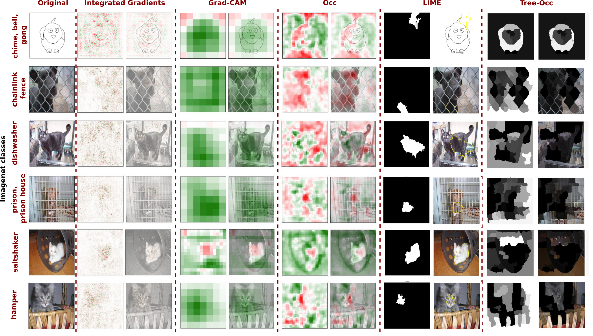

# **Reasoning with trees: interpreting CNNs using hierarchies**

Challenges persist in providing interpretable explanations for neural network reasoning in explainable AI (xAI). Existing methods like Integrated Gradients produce noisy maps, and LIME, while intuitive, may deviate from the model's reasoning. We introduce a framework that uses hierarchical segmentation techniques for faithful and interpretable explanations of Convolutional Neural Networks (CNNs). Our method constructs model-based hierarchical segmentations that maintain the model's reasoning fidelity and allows both human-centric and model-centric segmentation. This approach offers multiscale explanations, aiding bias identification and enhancing understanding of neural network decision-making. Experiments show that our framework delivers highly interpretable and faithful model explanations, not only surpassing traditional xAI methods, but shedding new light on a novel approach to enhancing xAI interpretability.




--

The code was developed in Python (64-bit) 3.8.8, Numpy 1.18.5, and Pytorch 1.12.0. 

List of used libraries:

- matplotlib (3.2.2)
- torchvision (0.13.0)
- Pillow (8.1.0)
- sklearn (1.1.2)
- scipy (1.4.1)
- pandas (1.2.1)
- captum (0.7.0)


--

Examples of use:

IG-Tree-Occ
```
python test_tree.py --dataset cat_dog --model vgg --gpu_id 0 --idx_img 0 --seg_type IntegratedGradients
```

Tree-CaOC
```
python test_tree.py --dataset cat_dog --model vgg --gpu_id 0 --idx_img 0 --attribution_occ caoc
```

It will generate an explanation image in outputs/ folder

--
## Datasets folder:

datasets/: folder in which the datasets should be placed. The experiments were performed for two datasets:

- cat_dog:
        
  Download from: [https://www.kaggle.com/competitions/dogs-vs-cats-redux-kernels-edition/data](https://www.kaggle.com/competitions/dogs-vs-cats-redux-kernels-edition/data)

- CIFAR10
  Automatically dowloaded

--
## Models' weights folder:

checkpoints/: include the models' weights here


